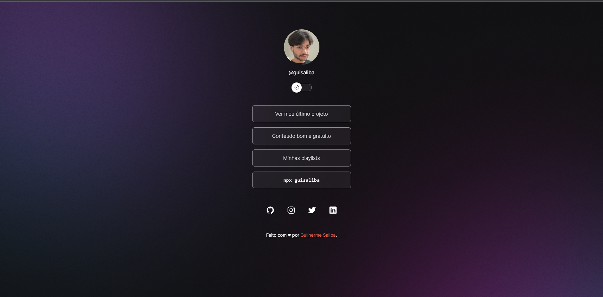

# aperture-wallet

<h1 align="center"> DevLinks </h1>

  O DevLinks é um website responsivo que serve como um Linktree de todos meus links e redes sociais.  

  <a href="#-tecnologias">Tecnologias</a>&nbsp;&nbsp;&nbsp;|&nbsp;&nbsp;&nbsp;
  <a href="#-projeto">Projeto</a>&nbsp;&nbsp;&nbsp;|&nbsp;&nbsp;&nbsp;
  <a href="#memo-licença">Licença</a>

  

 

  

## 🚀 Tecnologias

Esse projeto foi desenvolvido com as seguintes tecnologias:

- [HTML5](https://https://developer.mozilla.org/pt-BR/docs/Glossary/HTML)
- [CSS3](https://https://developer.mozilla.org/pt-BR/docs/Web/CSS)
- [JavaScript](https://https://developer.mozilla.org/pt-BR/docs/Web/JavaScript)
- [Git](https://https://git-scm.com/)

## 💻 Projeto

O DevLinks é um website responsivo que serve como um Linktree de todos meus links e redes sociais. Obrigado ao educador Mayk Brito da Rocketseat pelos ensinamentos que foram aplicados no desenvolvimento desse projeto.

## :memo: Licença

Esse projeto está sob a licença MIT.
